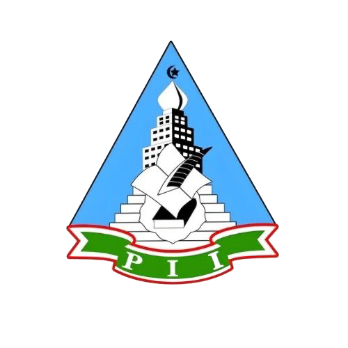
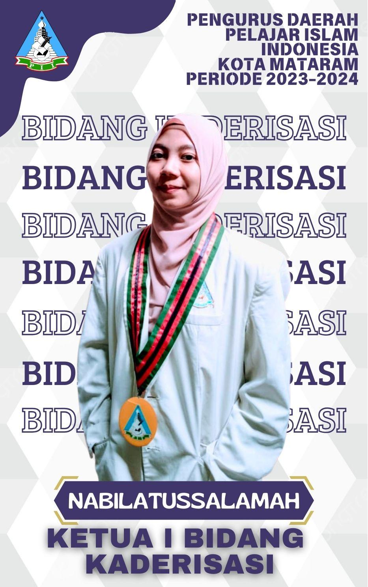

<html lang="id">
<head>
    <meta charset="UTF-8">
    <meta name="viewport" content="width=device-width, initial-scale=1.0">
    <title>Pelajar Islam Indonesia</title>
    <link rel="stylesheet" href="style.css">
</head>

<body>
    <header>
        

            
        

        <nav>
            <ul>
                <li><a href="#home">Beranda</a></li>
                <li><a href="#about">Tentang Kami</a></li>
                <li><a href="#programs">Program Kami</a></li>
                <li><a href="#management">Pengurus</a></li>
                <li><a href="#coming-soon">Segera Hadir</a></li>
                <li><a href="#contact">Kontak</a></li>
            </ul>
        </nav>
    </header>

    <section id="home" class="intro box">
        <h1>Selamat Datang di PD PII Kota Mataram</h1>
        
Untuk informasi lebih lanjut, silakan klik tombol berikut:

        <button>
            <a href="https://www.instagram.com/pd_pii_mataram?utm_source=ig_web_button_share_sheet&igsh=ZDNlZDc0MzIxNw==" target="_blank">Daftar Sekarang!</a>
        </button>
    </section>

    <section id="about" class="content box">
        <h2>Sejarah Pelajar Islam Indonesia</h2>
        

            Pelajar Islam Indonesia (PII) yang berdiri sejak tahun 1947 adalah organisasi yang bergerak untuk menangani berbagai permasalahan yang dihadapi oleh pelajar. 
            Dengan perkembangan zaman, PII tetap berkomitmen untuk mencetak generasi pelajar yang menjadi pemimpin masa depan. 
            PII memiliki berbagai program yang mendukung pembentukan karakter pelajar yang berakhlak mulia, cendekia, dan memiliki kepemimpinan. 
            Selain itu, PII juga mengadakan pelatihan tahunan sebagai kontribusi dalam pembentukan moral dan akhlak pelajar.
        

    </section>

    <section id="programs" class="content">
        <h3>Program Kami</h3>
        

            <article class="program">
                
                

                    <h4>Konfersi Daerah (KONDA) ke XXVII/KE-27</h4>
                    
Peralihan kepengurusan dari Ketua Umum periode 2022/2023 ke 2023/2024.

                

            </article>
            <article class="program">
                
                

                    <h4>HARBANAS PII KE-77</h4>
                    
Keluarga besar Pelajar Islam Indonesia NTB menyelenggarakan HARBANAS PII ke-77 dengan tema "Membangun Kolaborasi Indonesia", yang dilaksanakan bersama Kanda/Yunda KB PII NTB di SMAN 3 Mataram.

                

            </article>
            <article class="program">
                
                

                    <h4>Sosialisasi bersama MTs-SA Madrasatul Qur'aniyah</h4>
                    
PII Mataram berhasil mengadakan sosialisasi bersama siswa-siswi MTs Madrasatul Qur'aniyah. Kami mengucapkan terima kasih atas antusiasme yang tinggi dari para siswa.

                

            </article>
            <article class="program">
                
                

                    <h4>Ta'lim Bersama</h4>
                    
Pembentukan karakter Islami dimulai dengan memperkuat aqidah, keyakinan yang kokoh kepada Allah dan Rasul-Nya. Aqidah yang kuat akan menjadi landasan bagi segala perilaku dan tindakan kita, yang mencakup kejujuran, kesabaran, dan kasih sayang.

                

            </article>
            <article class="program">
                
                

                    <h4>PRA-BATRA 2024</h4>
                    
Kepengurusan Daerah Kota Mataram telah menyelenggarakan agenda acara #Pra-Batra. Terima kasih kepada semua pihak yang telah berkontribusi dalam menyukseskan acara ini.

                

            </article>
            <article class="program">
                
                

                    <h4>Sosialisasi Pondok Pesantren Dhiaul Fikri</h4>
                    
Dengan bangga kami umumkan bahwa sosialisasi ini berlangsung dengan lancar, didukung oleh KB PII NTB dan PD PII Lombok Tengah. Terima kasih kepada semua pihak yang telah berkontribusi.

                

            </article>
        

    </section>

    <section id="management" class="content box">
        <h2>Struktur Organisasi</h2>
    
        <!-- Pengurus Utama -->
        

            

                
                <h5>Sekretaris Umum</h5>
                
Cahaya Cinta Ilahi

            

            

                
                <h5>Ketua Umum</h5>
                
M. Qaerul Ibad

            

            

                
                <h5>Bendahara Umum</h5>
                
Rizkiyana Intan Pratiwi

            

        

    
        <!-- Pengurus Inti -->
        <h2>Kepengurusan Inti</h2>
        

            

                
                <h5>Ketua Bidang Kaderisasi</h5>
                
Nabilatussalamah

            

            

                
                <h5>Ketua Bidang Pengembangan dan Pemberdayaan Organisasi</h5>
                
Roy Afriyansah

            

            

                
                <h5>Ketua Bidang KU</h5>
                
Hamdi

            

            

                
                <h5>Ketua Bidang Keputrian</h5>
                
Nadiratul Munawarah

            

        

    
        <!-- Anggota -->
        <h2>Anggota</h2>
        

            

                
                <h5>Anggota Bidang Kaderisasi</h5>
                
Pahmi Hanif Supake

            

            

                
                <h5>Anggota Bidang Kaderisasi</h5>
                
Rizki Wahyu Kurniawan

            

            

                
                <h5>Anggota Bidang KU</h5>
                
Zayyid Zen

            

            

                
                <h5>Anggota Bidang KU</h5>
                
Zulkarnaen

            

            

                
                <h5>Anggota Bidang KU</h5>
                
Isnia Diani

            

            

                
                <h5>Anggota Bidang KU</h5>
                
Zaenudin Hadi

            

            

                
                <h5>Anggota Bidang Keputrian</h5>
                
Hanifa Amalia

            

            

                
                <h5>Anggota Bidang Keputrian</h5>
                
Dian Aprilia

            

            

                
                <h5>Anggota Bidang Keputrian</h5>
                
Fitriana

            

        

    </section>

    <section id="coming-soon" class="content">
        <h2>Segera Hadir</h2>
        
TA'LIM UMUM 2025
https://www.instagram.com/p/DFNtt_AT6Y9/?utm_source=ig_web_copy_link&igsh=MzRlODBiNWFlZA==.

    </section>

    <footer id="contact">
        <h2>Kontak Kami</h2>
        

            Pengurus Daerah Pelajar Islam Indonesia Kota Mataram Periode 2023/2024 
            Email: <a href="mailto:pdpiikotamataram@gmail.com">pdpiikotamataram@gmail.com</a> 
            Telepon: +62 838-9841-5041 
            Instagram: <a href="https://instagram.com/pd_pii_mataram" target="_blank">@pd_pii_mataram</a> 
            Alamat: Jl. Terusan Bung Hatta, Rembiga, Kec. Selaparang, Kota Mataram, Nusa Tenggara Barat. 83124
        

    </footer>

</body>
</html>
